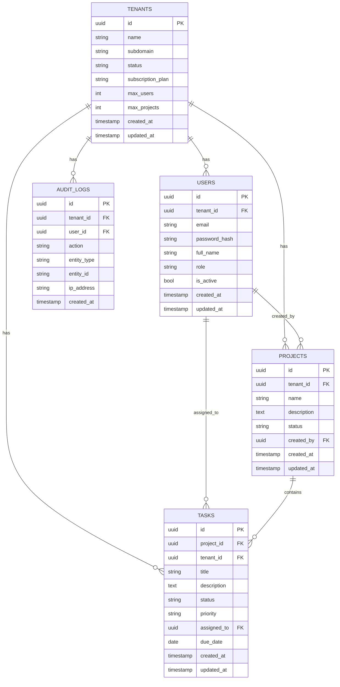

# Architecture

Diagrams are available at:
- System architecture: `docs/images/system-architecture.png`
- Database ERD: `docs/images/database-erd.png`

Mermaid sources (for easy regeneration) are embedded below.

```mermaid
flowchart LR
	Browser[Browser / SPA] -->|HTTPS| Frontend[Frontend (React + Vite)]
	Frontend -->|REST / Authorization: Bearer JWT| Backend[Backend (Express API)]
	Backend -->|PG pool| DB[(PostgreSQL)]
	Backend -->|Audit events| Audit[(audit_logs table)]
	subgraph Containers
		Frontend
		Backend
		DB
	end
	classDef svc fill:#111827,stroke:#6B7280,color:#E5E7EB;
	classDef data fill:#0F172A,stroke:#6B7280,color:#F8FAFC;
	class Frontend,Backend svc;
	class DB,Audit data;
```



## System overview
- **Frontend (Vite + React)**: single-page app, calls backend via REST, uses JWT stored in memory (Authorization header) and pulls current user via `/api/auth/me`.
- **Backend (Node.js + Express)**: stateless APIs with JWT auth, RBAC, input validation, subscription limit middleware, audit logging.
- **Database (PostgreSQL)**: shared database, shared schema; every table includes `tenant_id` and is indexed for tenant-scoped queries.
- **Containerization**: Docker Compose orchestrates `frontend` (3000), `backend` (5000), and `database` (5432) with a shared network.

## Multi-tenancy model
- **Isolation**: shared DB, shared schema; all domain tables include `tenant_id`. Queries enforce tenant scoping and RBAC guards.
- **Access control**: roles `super_admin`, `tenant_admin`, `user`. Super admins can see all tenants; other roles are restricted to their tenant.
- **Limits**: subscription middleware enforces `max_users` and `max_projects` per tenant (plan defaults in `utils/plans.js`).

## Data model (ERD in prose)
- **tenants** (`id`, `name`, `subdomain`, `status`, `subscription_plan`, `max_users`, `max_projects`, timestamps)
- **users** (`id`, `tenant_id?`, `email`, `password_hash`, `full_name`, `role`, `is_active`, timestamps) — `tenant_id` null only for `super_admin`.
- **projects** (`id`, `tenant_id`, `name`, `description`, `status`, `created_by`, timestamps)
- **tasks** (`id`, `project_id`, `tenant_id`, `title`, `description`, `status`, `priority`, `assigned_to`, `due_date`, timestamps)
- **audit_logs** (`id`, `tenant_id`, `user_id`, `action`, `entity_type`, `entity_id`, `ip_address`, `created_at`)

Relationships:
- tenants 1—N users, projects, tasks, audit_logs
- projects 1—N tasks
- users 1—N projects (created_by) and 1—N tasks (assigned_to)

## Request flow
1. Client authenticates via `/api/auth/login` (email + password + tenant subdomain/id). Backend issues JWT (24h) with `userId`, `tenantId`, and `role`.
2. Protected routes require `Authorization: Bearer <token>`; middleware verifies JWT and sets `req.user`.
3. RBAC checks inside controllers ensure tenant scoping and role-based permissions; subscription middleware enforces plan limits on create actions.
4. Responses use a consistent `{ success, message, data }` envelope.

## API architecture
- **Routing**: Express routers under `/api/*` (auth, tenants, users, projects, tasks, health).
- **Middleware**: `helmet`, `cors`, `morgan`, JSON body parsing, `authenticate`, `handleValidation`, `subscription` limit checks, centralized error handler.
- **Validation**: `express-validator` on inputs for types, enums, email/password rules.
- **Auditing**: `logAction` writes to `audit_logs` for key events (login/logout, CRUD on tenants/users/projects/tasks).

## Deployment
- **Docker Compose**: one Postgres container with mounted data volume; backend and frontend build from repo Dockerfiles; services share an internal network.
- **Ports**: 3000 (frontend), 5000 (backend), 5432 (database). CORS origin is configured via `FRONTEND_URL`.
